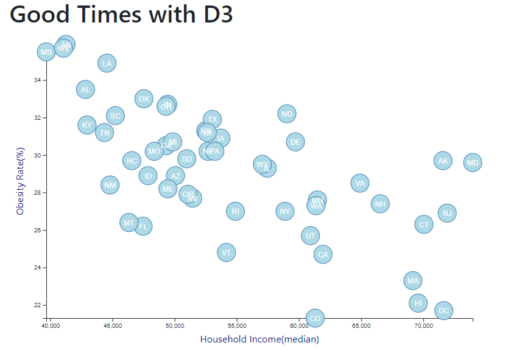

# Data Journalism

* Obesity vs Income: This data, taken from the 2014 ACS 1-year estimates from the U.S. Census Bureau, looks at the health risks associated with certain demographics within each state. The files contained here provide an interactive scatter plot comparing state obesity rates with state median income. 

# Files

* [`Data journalism.index`](D3_data_journalism/index.html) - Html file, that displays web page with the scatter plot and data analysis. 

* [`assets/js`](D3_data_journalism/assets/js/) - File that contains all the primary code to run the interactive functionality.

* [`assets/data`](D3_data_journalism/assets/data/) - Data file, containing 2014 ACS 1-year estimates from the U.S. Census Bureau.

# Results

# Data Analysis

Correlations Discovered Between Obesity and Income
The correlations between income and health risks has been widely studied and documented. The average life expectancy in the United States strongly correlates with annual income of individuals. Looking specifically at median income compared to obesity rates, there are a few points that stood out.

1) The 3 states that had the highest obesity rates, also came in as the bottom 3 for lowest income. Likewise, high median income states tended to have very low obesity rates.

2) The 3 of the top 4 states in highest median income had obesity rates that were in the mid-range compared to other states. This was surprising, and shows there are factors, aside from income, that play a role in obesity rates.

3) While there does seem to be a direct correlation between income and obesity, it appears that over approximately $60,000, there is a diminished return on how much income affects the overall obesity rate.

-----------------------------------------------------------------------------------------------------------------------------------------------------------------------------------
Created in fun by Erica in 2021
